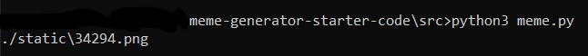
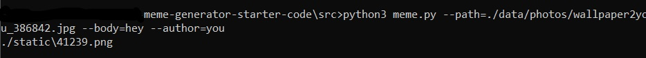
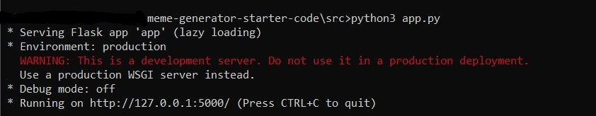
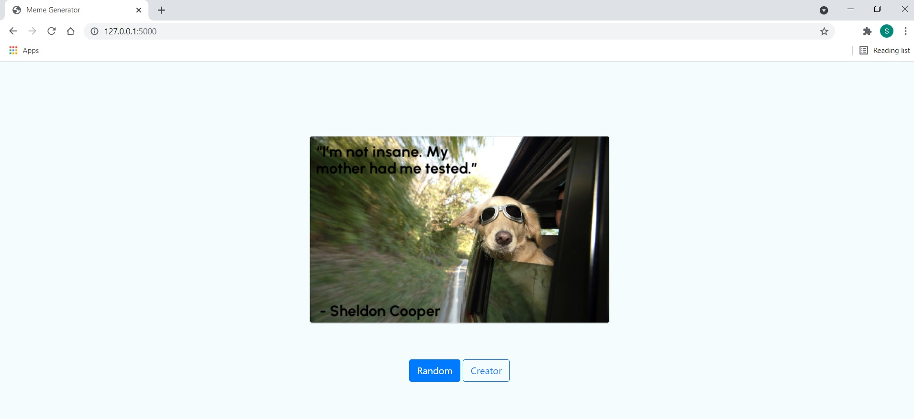

# Meme Generator Project
This project is from Udacity's Intermediate Python Nanodegree program. <br>It contains a command line application as well as a web application which takes in a photo and a <br>quote and generates a meme. The web app runs on the local machine using flask library. <br>Both tools can generate a random meme built from the photos in "./src/data/photos" and the <br>quotes in "./src/data/quotes" or accept a path to both a photo and quote file and generate a meme. <br>All photos are taken from "https://wallpaper-house.com/" and all <br>quotes are taken from "https://parade.com/940913/parade/funny-quotes/"

- Random command line:
Run ```python3 meme.py``` in the "./src" folder and the path to the generated meme will be output.



- Specified command line:
Run ```python3 meme.py --path=(path to img) --body="body text" --author="author" and the path to the generated meme will be output



- Flask server:
Run ```python3 app.py``` to start flask server. IP address will be output. Paste into web browser to see the web app.



Then you can click "Random" to generate a random meme or click "Creator" to input a custom photo and quote.




There are 2 primary modules which drive the meme generator: QuoteEngine ("./src/QuoteEngine") and MemeGenerator ("./src/MemeGenrator"). <br>I will go into a bit more detail here about how they work.

### QuoteEngine
This module contains 2 files: "QuoteModel.py" and "Ingestor.py"

**QuoteModel.py**

This contains a single class which encapsulates a quote body and author into a single unit

**Ingestor.py**

This is responsible for parsing files and creating a list of QuoteModel objects to be used in the random meme generator. It has 3 parts:
- IngestorInterface

An abstract interface which should be implemented by each file type specific ingestor.

- Specific Ingestors e.g. PDFIngestor

Each of these are responsible for implementing the specific code required to parse a specific file type for quotes

- Ingestor

This is the outward facing class which handles all parsing requests. <br>It maintains a list of available ingestors and dispatches the parse request to the proper ingestor if available.

### MemeGenerator
This module uses pillow image library and textwrap to create the final meme given an image path and a quote.

**MemeEngine.py**
Contains a class "MemeEngine" which takes in an image url and a quote, then uses pillow library to overlay the quote onto the image as a meme.
